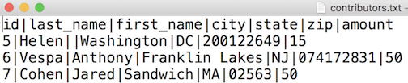
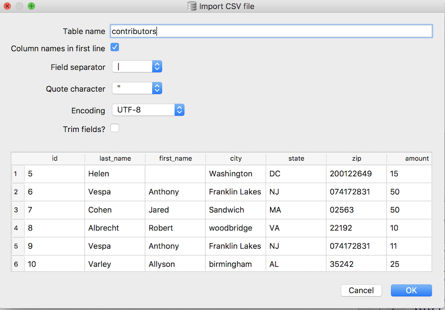
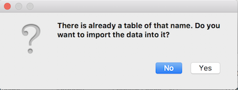

Importing data from a file
~~~~~~~~~~~~~~~~~~~~~~~~~~

One common task we all face in data management is
importing a data set into the database. Often, we receive a file in
some other format such as MS Excel, CSV (comma-separated values) or
tab-delimited and we want to get those values into a database table in
order to run SQL queries on them.

Each database management system handles importing values from a file a
bit differently. *DB Browser for SQLite* provides a nice interface for
performing data imports from text files.

First, let's grab a plain text file full of contributors from the FEC
database. Download :download:`contributors.txt <../_data/contributors.txt>`
and save it somewhere you can find it (your Desktop is a good place).

Check out the first few lines of the file below. Notice that this file is 
pipe-delimited (the columns are separated by
the **\|** character).

|image1|

I find this delimiter easy to use because it's
unlikely to appear within a value in the import data. But using comma or
tab characters to separate the values will work as well.

Now that we know what we're importing, let's try importing the data into the
"contributors.db" we created in :doc:`Part 1 <../part1/first-db-and-table>` 
of the tutorial.

* Fire up *DB Browser*
* Click "Open Database"
* Locate your "contributors.db" file and click OK
* Start up the import wizard by selecting ``File -> Import -> Table from CSV file...``
* Navigate to the "contributors.txt" file that you downloaded, and click Open.

The import wizard should appear, which you can use to define your
import.

|image2|

-  Check the "Column names in first line" checkbox.
-  Select the **pipe(|)** for “Field separator”
-  Uncheck the "Trim fields?" checkbox

For everything else, you can keep the default selections.

Click OK and you should get a pop-up notifying you that a table of the same
name (*contributors*) already exists, and asking if you want to import the 
data into that table.

|image3|

Click "Yes" and the data import should proceed.

You should now have 103 rows of data to play with (the newly imported 100 rows,
plus the original three add during the :doc:`../part1/inserting-data` section).

The FEC data is dirty: there are missing fields, first names include middle names, there are
weird values for some columns. Play around with it using the SQL you
know, and see what you can find out. If you get surprising results from
a query or are wondering how to do something, add a comment to the blog
post.

*You should also save the database changes you've made so far so you don't 
lose your work.* You can save the changes by clicking the "Write Changes" button:

|image4|

