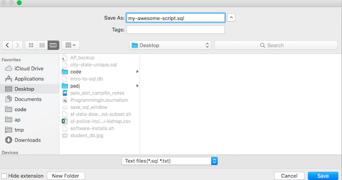

Saving scripts
~~~~~~~~~~~~~~

As you start writing more SQL, it's helpful to work on each query
in a separate SQL pane and to save your work as reusable scripts.

*DB Browser for SQLite* offers a few handy features for this workflow,
including the ability to save and re-open scripts.

If you navigate to the *Execute SQL* panel, you should see a series of buttons towards the
upper left that look like this:

   |sql_new_open_save_tab|

You can create new tabs for additional SQL queries by clicking the *Open tab* button (|open_tab|).

You can save the SQL in any tab using the *Save SQL file* button (|save_sql_button|).
This will fire up a window that lets you choose a location and name for your script.

   Scripts should always have a *.sql* file extension, e.g. *my-awesome-script.sql*

   |save_sql_window|

Finally, you can re-open a saved script by clicking the *Open SQL file* button (|open_sql_file_button|).

