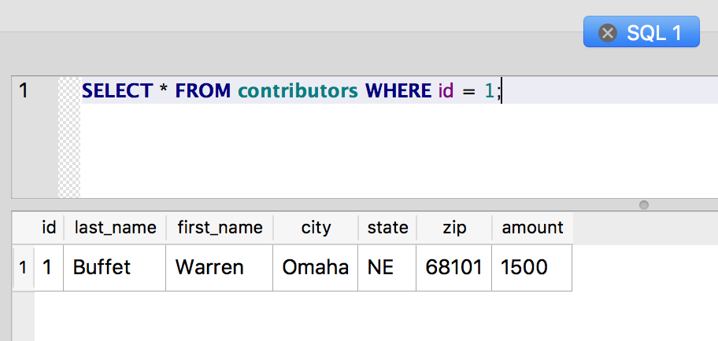

Deleting data
~~~~~~~~~~~~~

The remaining keyword from the original list is ``DELETE``, which
unsurprisingly deletes rows from the table. As when using UPDATE, it's
important to specify a WHERE clause with DELETE. Running DELETE without
a WHERE clause will blow away your precious data and can seriously ruin
your day.

Before executing a DELETE or UPDATE, it's always a good idea to run a
SELECT with the same WHERE clause, just to see which rows your changes
will affect.

So, let's get rid of one of our rows. How about deleting Warren Buffet?

For our WHERE clause, we could match on any column or combination of
columns, but if we know the PRIMARY KEY value of the row, that’s our
safest bet. Because it's a unique identifier, we can be certain we're
not accidentally deleting other rows. First let's make sure we have the
row we want:

::

   SELECT * FROM contributors WHERE id = 1;

|image1|

Looks like the one we want, so let's delete it:

::

   DELETE FROM contributors WHERE id = 1;

..

   Notice that we don't need to specify columns or use \* with DELETE,
   since we're deleting the entire row.

Now the row should be gone:

::

   SELECT * FROM contributors;

