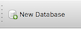
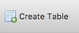
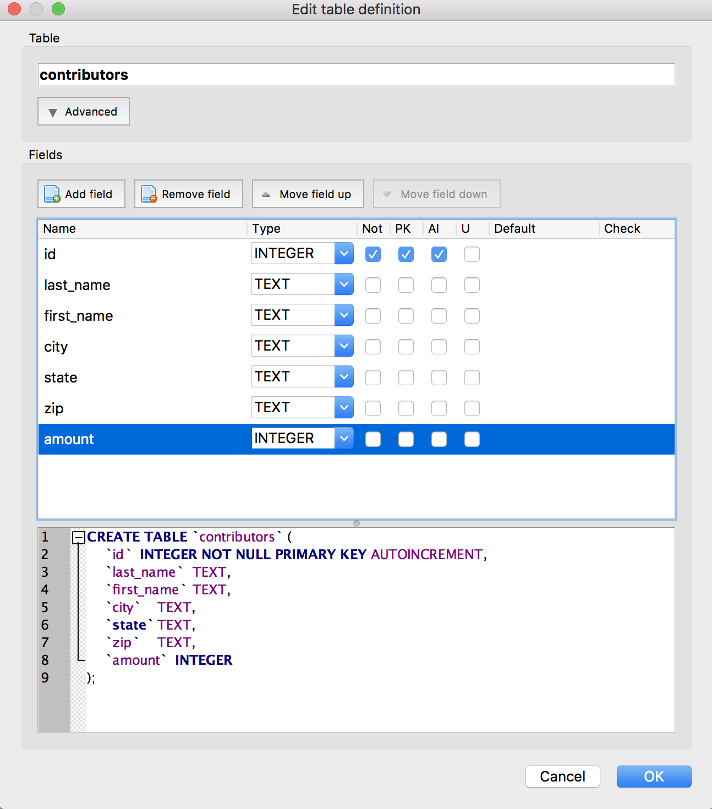
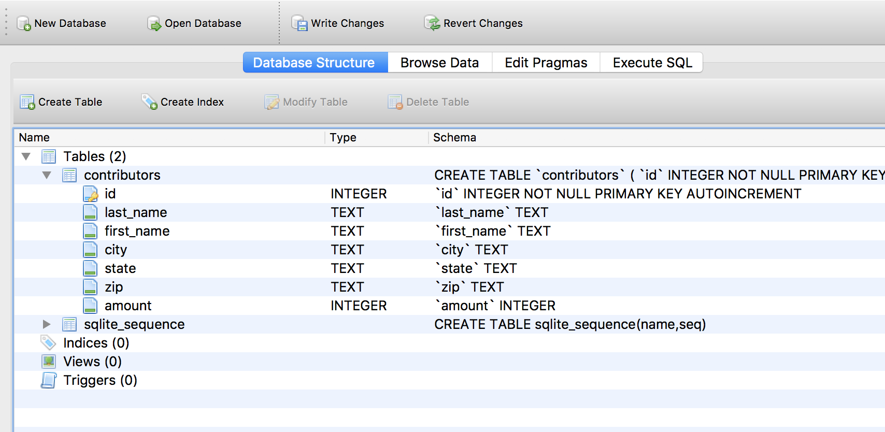

Creating the First Database
~~~~~~~~~~~~~~~~~~~~~~~~~~~

Mousing over each of the icons at the top of the *DB Browser* tool will
show what the icon does.

To create a database, simply click on the icon for “New Database”:

|image1|

Name the database “contributors” and save it anywhere you like (the desktop will
work, or your documents folder). This single file will contain the
entire database you create.

    Note: As you do work in *DB Browser*, be aware that it will not
    automatically save your work. If you plan to step away from the tutorial,
    be sure to save your changes by clicking the "Write Changes" button:

    |write_changes_button|

    You can also :doc:`save SQL queries <../appendix/saving-scripts>` as individual scripts.

Creating a Table
~~~~~~~~~~~~~~~~

| Click the “Create Table” icon (|image2|), and you’ll get a form
  allowing you to create a new table.
| To create a table, we have to define the attributes or columns that
  make it up. For each column, we define the datatype of the data it
  will contain.

Name the table “contributors” and begin creating columns as below by
clicking the “Add field” button.

**Note: You should name and order the fields AND fill in the drop-down
menu and checkboxes exactly as displayed!**

|image3|

**Important notes**

Some important things to note:

-  As you start adding fields and options, note how the table creation
   SQL in the bottom pane dynamically updates.
-  The ``id`` field will be a unique identifier for each contributor
   (and therefore will be the “Primary Key” for the row), which is why
   we checked the ``PK`` box for this one field. Checking the ``AI`` box
   will make this integer automatically increment for each row we add
   (so each new row will have a new id). Finally, this field should not
   be null or empty (because we need it as the unique identifier), so we
   check the ``Not`` box as well.
-  The next five columns will all contain text strings of undetermined
   lengths (last names, for example, come in all kinds of lengths), so
   we’ll use the ``TEXT`` datatype, which allows for text of varying
   length.

By the way, it may seem strange that the ``zip`` column uses a ``TEXT``
datatype, but remember that some zips start with a 0 (00501 is in NY).
So, we want to treat this column as a string of text, rather than as a
number (which would be 501).

Click OK and *DB Browser* will create the table based on your
specifications, by executing the full SQL statement in the lower pane of
the table creation window:

::

   CREATE TABLE `contributors` (
       `id`    INTEGER NOT NULL PRIMARY KEY AUTOINCREMENT,
       `last_name` TEXT,
       `first_name`    TEXT,
       `city`  TEXT,
       `state` TEXT,
       `zip`   TEXT,
       `amount`    INTEGER
   );

The syntax should be fairly clear, since it just reflects the choices we
made in the form. It’s creating a table called “contributors” with the
fields and data types we’ve defined.

You should now have a “contributors” table in the list in the Database
Structure panel of the manager. Clicking the arrow beside the listing
for “contributors” will show you the column list for the table.

|image4|

.. |write_changes_button| image:: ../_static/part1/write_changes_button.png
