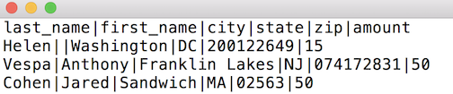
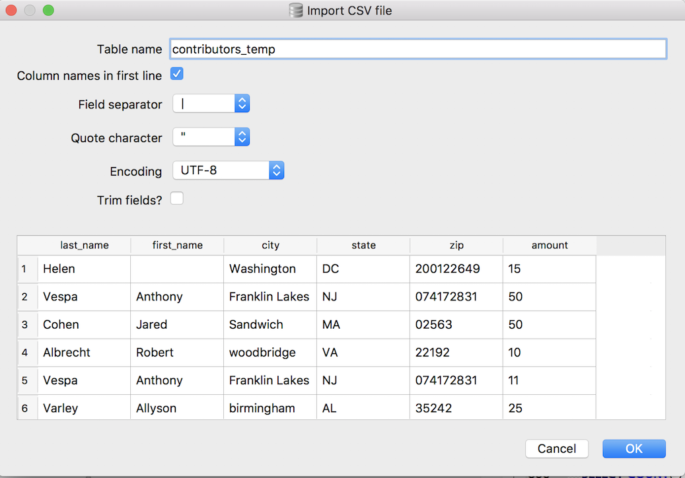

Importing data from a file
~~~~~~~~~~~~~~~~~~~~~~~~~~

Finally let's move on to a topic that takes us a bit outside the basic
SQL syntax. One common task we all face in data management is
importing a data set into the database. Often, we receive a file in
some other format such as MS Excel, CSV (comma-separated values) or
tab-delimited and we want to get those values into a database table in
order to run SQL queries on them.

Each database management system handles importing values from a file a
bit differently. *DB Browser for SQLite* provides a nice interface for
performing data imports from text files.

First, let's grab a plain text file full of contributors from the FEC
database. Download :download:`contributors.txt <../_data/contributors.txt>`
and save it somewhere you can find it (your Desktop is a good place).

Check out the first few lines of the file below. Notice that this file is 
pipe-delimited (the columns are separated by
the **\|** character).

|image1|

I find this delimiter easy to use because it's
unlikely to appear within a value in the import data. But using comma or
tab characters to separate the values will work as well.

Also notice that there is no ``id`` column here. *DB Browser* will be
unable to directly import this data into the existing ``contributors``
table. Instead, we'll import this data into a new, temporary table
called ``contributors_temp``, and then use a SQL ``INSERT`` statement to
copy the rows into our original ``contributors`` table. Along the way,
SQLite will populate the ``id`` field for each row using auto-increment,
the same as it did for our earlier ``INSERT`` examples.

Now that we know what we're importing, go back to *DB Browser* and open
the import wizard by selecting
``File -> Import -> Table from CSV file...``, navigate to the
"contributors.txt" file and click Open.

The import wizard should appear, which you can use to define your
import.

|image2|

-  Type "contributors_temp" in the "Table name" field
-  Check the "Column names in first line: checkbox.
-  Select the **pipe(|)** for “Field separator”
-  Uncheck the "Trim fields?" checkbox

For everything else, you can keep the default selections.

Click OK and the data should import into a new table called
``contributors_temp``.

   Note that *DB Browser* is doing a bit of magic here. We didn't have to
   manually define the ``contributors_temp`` table. Instead, *DB Browser*
   simply created a table with column names matching our field headers,
   automatically set the column data types to ``TEXT``, and inserted the
   rows for us.

Now that we loaded our temporary table, we're ready to copy the new rows
into our main table by running the below SQL:

::

   INSERT INTO contributors(last_name, first_name, city, state, zip, amount) 
   SELECT * FROM contributors_temp;

Finally, you'll probably want to delete the temporary table now that
it's done it's job. Just select ``contributors_temp``, right-click and
choose ``Delete table`` and click Yes.

*You should also save the database changes you've made so far so you don't 
lose your work.* You can save the changes by clicking the "Write Changes" button:

|image3|

And now you have 103 rows of data to play with. The FEC data is dirty:
there are missing fields, first names include middle names, there are
weird values for some columns. Play around with it using the SQL you
know, and see what you can find out. If you get surprising results from
a query or are wondering how to do something, add a comment to the blog
post.

We’ll pick up with some more advanced queries and functions in :doc:`../part2`.

.. |image3| image:: ../_static/part1/write_changes_button.png

