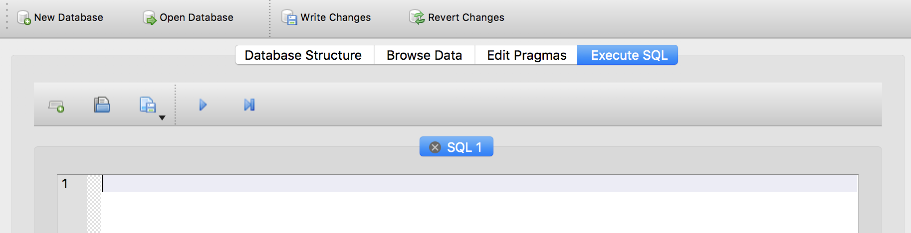
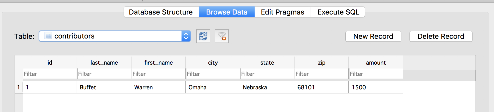

Inserting Data
~~~~~~~~~~~~~~

Now that we have a table in the database, we can start inserting data.
This task is accomplished with (oddly enough) an ``INSERT`` statement.

Click the "Execute SQL" tab in the second menu row, under the
icons for creating/opening databases:

|image1|

The top pane with the flashing cursor is where you can write SQL
queries. Since we don’t have data in the table yet, let’s go ahead and
insert some by copying and pasting the below SQL into the pane with the
flashing cursor.

::

   INSERT INTO contributors (last_name, first_name, city, state, zip, amount) 
   VALUES ('Buffet', 'Warren', 'Omaha', 'Nebraska', '68101', 1500);

This is a little more obscure than the ``CREATE`` or ``SELECT`` syntax,
but it’s still fairly clear. To insert a row in the table, we execute
the ``INSERT INTO`` statement with a table name, a list of columns to
populate, and the ``VALUES`` for each of those columns. **The order of
the columns in the column list must match the order of values in the
values list.**

It’s very important to surround text values with single quotation marks.
Two things to note:

-  The quotation marks indicate to SQL that this is a literal string
   (the word ‘Buffet’), rather than a column name or other special
   usage.
-  SQL uses single quotation marks around text strings. Some database
   systems will also accept double quotes, but some will throw an error.
-  The commas between values are placed outside of the quote marks, not
   inside.

Notice that we didn’t insert a value for id. Because we set that column
to AUTOINCREMENT, SQLite will populate the id with the next integer in
the sequence. So, we don’t need to worry about choosing unique ids;
SQLite takes care of it.

Finally, we didn’t include dollar signs or commas in the “amount”
column. We created the “amount” column as an integer, so we should only
insert integers there. (Different database management systems will react
differently if you try to insert non-numeric characters in an integer
column; it’s best to avoid doing so.)

If you haven’t done so already, click the Execute SQL button |image2|.

The bottom pane should say “Query executed successfully” followed by a
copy of the SQL that was executed. **Success! You’ve added data!**

You can view the data by going to the “Browse Data” tab:

|image3|

Just so we’ll have some data to play with, let’s execute a few more
``INSERT`` statements. Go back to the “Execute SQL” tab and paste in
these lines:

::

   INSERT INTO contributors (last_name, first_name, city, state, zip, amount) VALUES ('Winfrey', 'Oprah', 'Chicago', 'IL', '60601', 500);
   INSERT INTO contributors (last_name, first_name, city, state, zip, amount) VALUES ('Chambers', 'Anne Cox', 'Atlanta', 'GA', '30301', 200);
   INSERT INTO contributors (last_name, first_name, city, state, zip, amount) VALUES ('Cathy', 'S. Truett', 'Atlanta', 'GA', '30301', 1200);

You can paste all three lines into the SQL text box at the same time.
The semi-colons indicate the end of each statement.

   Before inserting these new records, you should delete the original
   ``INSERT`` statement to avoid re-running it, which would result in a
   duplicate record.

Click the “Execute SQL” button.

You can view the new records in the “Browse Data” tab. **You should see
4 rows in total now.**

