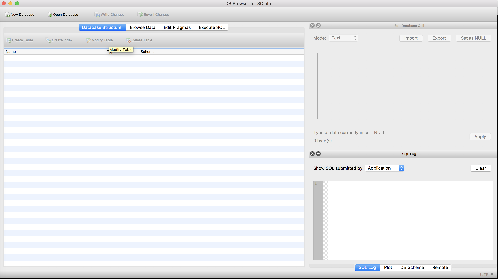

Installing DB Browser for SQLite
~~~~~~~~~~~~~~~~~~~~~~~~~~~~~~~~

To create our own databases, we’ll use the free and open source `DB
Browser for SQLite <https://sqlitebrowser.org/>`__. Per their
documentation:

   DB Browser for SQLite is a high quality, visual, open source tool to
   create, design, and edit database files compatible with SQLite. It is
   for users and developers wanting to create databases, search, and
   edit data. It uses a familiar spreadsheet-like interface, and you
   don’t need to learn complicated SQL commands.

Go to `this page <https://sqlitebrowser.org/dl/>`__, download the installer
appropriate for your machine, and execute the installer.

Once finished, search for the program and fire it up.

On a Mac, you can hit ``Command + Space bar`` and type your search to
find the program, or search in **Launchpad**.

|start_window|

