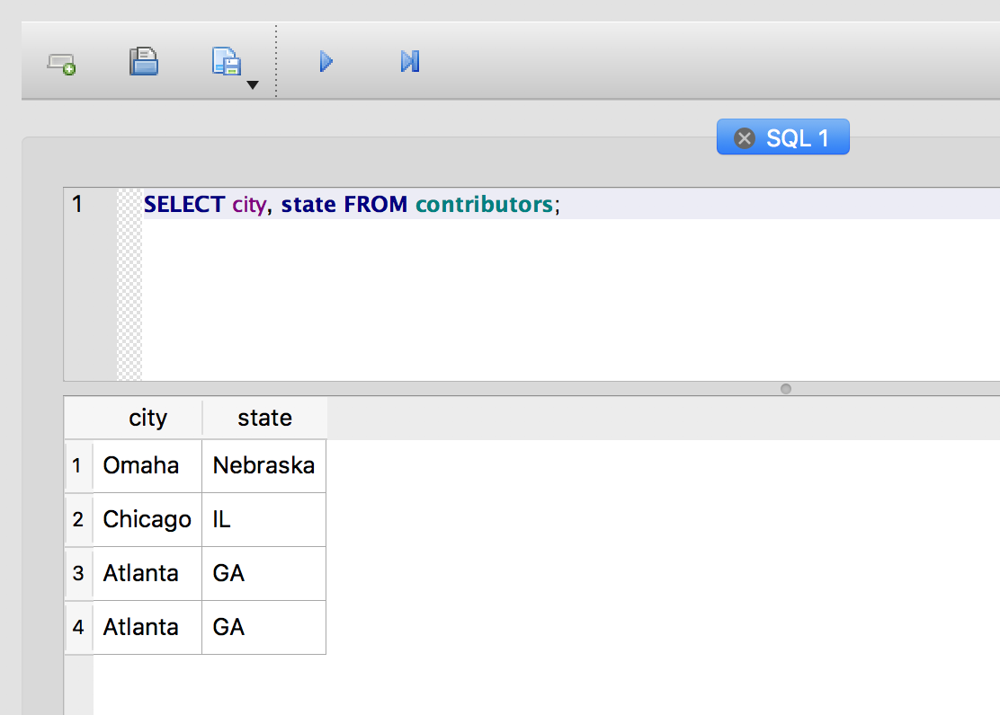
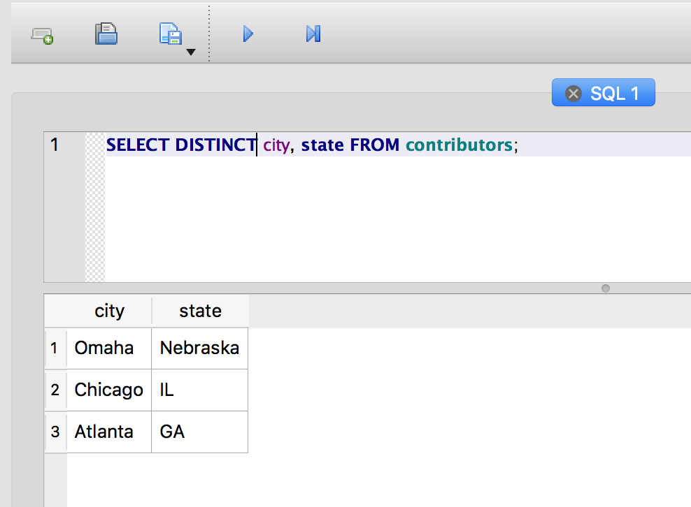
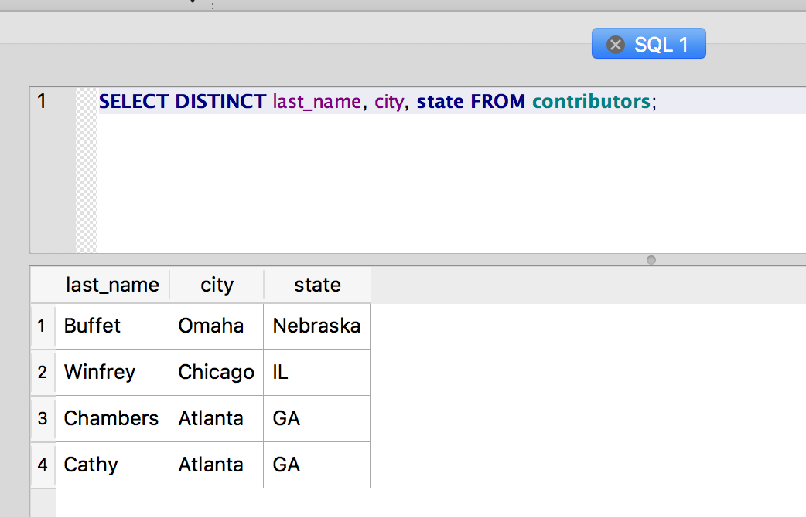
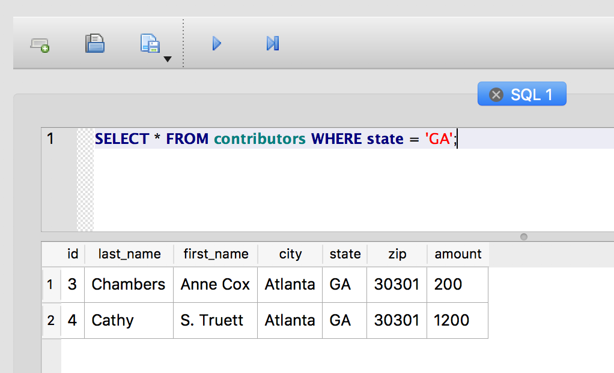
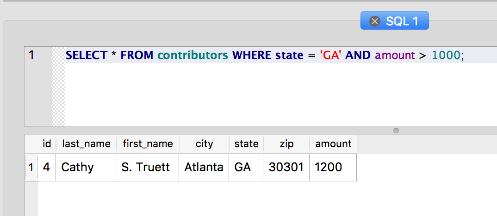
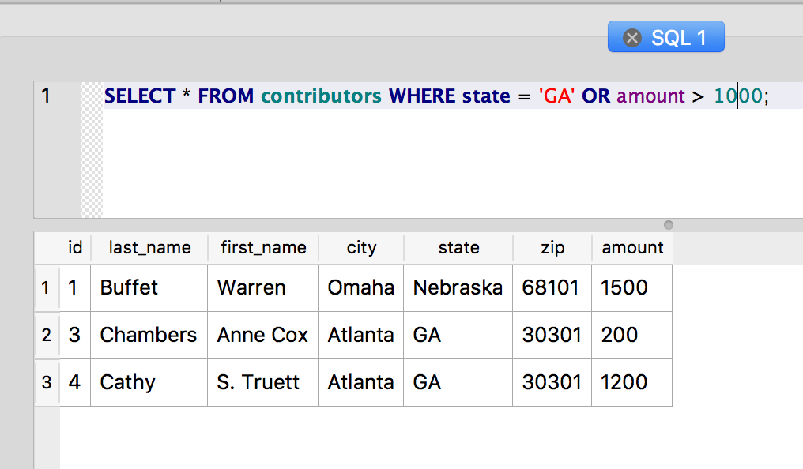
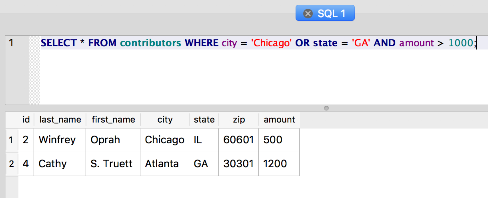

Querying Data
~~~~~~~~~~~~~

Now that we have a small data set to use, let’s start querying it
by using the ``SELECT`` statement.

Navigate to the "Execute SQL" panel and type the following into the SQL text box:

::

   SELECT * FROM contributors;

Now click the "Execute SQL" button.

You should see a nice grid display of all contributors you’ve added. The
``*`` character is a common wildcard. In this ``SELECT`` statement, it is used to
retrieve all columns. So, we have selected all columns from all rows in
the contributors table.

To define which columns of data you want to return, simply provide a
comma-separated list of column names to ``SELECT``:

::

   SELECT city, state FROM contributors;

Clicking "Execute SQL" should give you a two-column table of cities and
states.

|image1|

Using DISTINCT to get a distinct set
~~~~~~~~~~~~~~~~~~~~~~~~~~~~~~~~~~~~

The SELECT query above gives us a list of cities and states, but it
includes duplicate rows for Atlanta, GA. Adding ``DISTINCT`` to the
query eliminates the duplicates:

::

   SELECT DISTINCT city, state FROM contributors;

|image2|

Now you should have only three rows in your results, showing the unique
combinations for city and state in the table.

Notice what happens if you add the ``last_name`` field to the ``DISTINCT``
query:

::

   SELECT DISTINCT last_name, city, state FROM contributors;

|image3|

We’re back to four rows. There are four distinct combinations of
last_name, city and state in the table, so that’s what we get from
``DISTINCT``.

The WHERE Clause
~~~~~~~~~~~~~~~~

The ``WHERE`` clause provides the scalpel for your SQL operations. A
well-crafted ``WHERE`` clause can let you take exactly the slice of the
data you want. It sets the conditions for the ``SELECT``, and the query will
return only those rows that match the conditions.

Say, for example, we only wanted to see contributors from Georgia:

::

   SELECT * FROM contributors WHERE state='GA';

..

   Remember the single quotes around the string "GA"

|image4|

And you can test for more than equality in the ``WHERE`` clause. This query
finds only the contributors who have donated more than $1200:

::

   SELECT * FROM contributors WHERE amount > 1200;

Of course, donors who have given exactly $1200 won’t be included in the
results. To include them, use the ``>=`` operator:

::

   SELECT * FROM contributors WHERE amount >= 1200;

Here are some other operators you can use:

+--------------+-----------------------+
| **operator** | **description**       |
+--------------+-----------------------+
| =            | Equal                 |
+--------------+-----------------------+
| !=           | Not equal\*           |
+--------------+-----------------------+
| >            | Greater than          |
+--------------+-----------------------+
| <            | Less than             |
+--------------+-----------------------+
| >=           | Greater than or equal |
+--------------+-----------------------+
| <=           | Less than or equal    |
+--------------+-----------------------+

..

   \* Many database systems also use <> for “Not equal”

Combining conditions with AND and OR
~~~~~~~~~~~~~~~~~~~~~~~~~~~~~~~~~~~~

You can combine conditions using ``AND`` and ``OR``. For example, let’s
find all contributors from Georgia who have given more than $1000:

::

   SELECT * FROM contributors WHERE state = 'GA' AND amount > 1000;

|image5|

Now let's find all contributors who either live in Georgia or who have
given more than $1000:

::

   SELECT * FROM contributors WHERE state = 'GA' OR amount > 1000;

|image6|

And now let's try to get the big spenders from Chicago and Georgia:

::

   SELECT * FROM contributors WHERE city = 'Chicago' OR state = 'GA' AND amount > 1000;

|image7|

Hmm . . . Oprah is in the list, but she only donated $500. What gives?

The problem here is that the ``AND`` operator has a higher precedence
than the ``OR`` operator, which means it gets evaluated first. So, in
effect, our query really looks like this:

::

   SELECT * FROM contributors WHERE city = 'Chicago' OR (state = 'GA' AND amount > 1000);

Which selects all contributors from Chicago and only those contributors
from Georgia who have also donated more than $1000.

We can use parentheses to clarify the original query and actually get
the high rollers we wanted:

::

   SELECT * FROM contributors WHERE (city = 'Chicago' OR state = 'GA') AND amount > 1000;

Parentheses are often helpful when you need to disambiguate a query.
Technically, you're changing the order of evaluation here, but you’re
also just making the intention of your statement clear.

