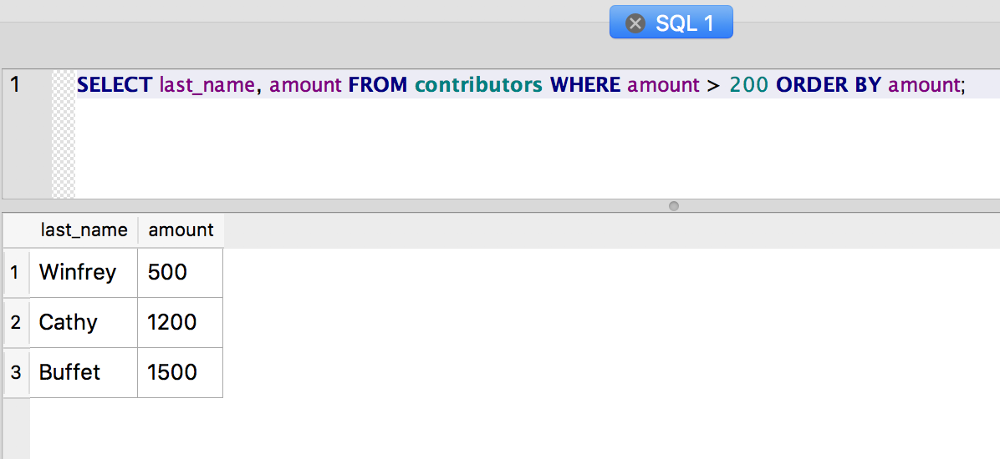
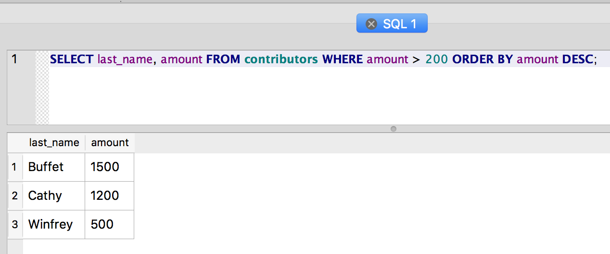
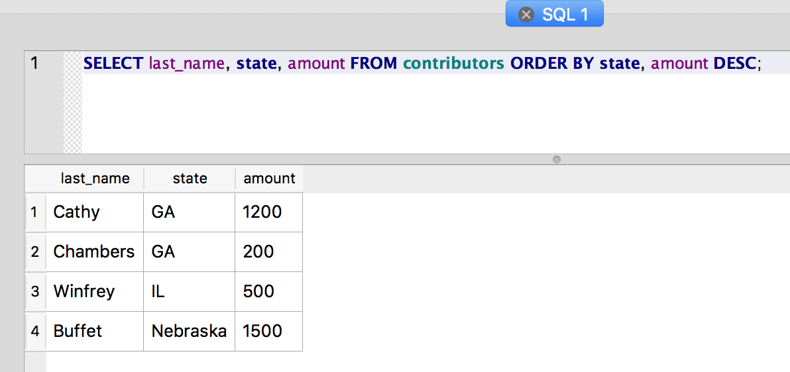

Sorting results with ORDER BY
~~~~~~~~~~~~~~~~~~~~~~~~~~~~~

To order your result set by the values in a particular column, use
``ORDER BY``:

::

   SELECT last_name, amount FROM contributors WHERE amount > 200 ORDER BY amount;

|image1|

Only the rows matching the ``WHERE`` clause are returned (i.e. only
those with an amount exceeding $200).

The default direction for ``ORDER BY`` is ascending; results are ordered
from smallest amount to greatest.

To specify the direction of the sorting, use the ``DESC`` or ``ASC``
keyword:

::

   SELECT last_name, amount FROM contributors WHERE amount > 200 ORDER BY amount DESC;

|image2|

You can also order the results by more than one column. Rows with the
same value for the first column of the ``ORDER BY`` are further ordered
by the additional column(s):

::

   SELECT last_name, state, amount FROM contributors ORDER BY state, amount DESC;

|image3|

Here we get the list of contributors ordered by state and then ordered
by the amount, from highest to lowest amount within the state, of their
contribution. This is one quick way to see who has contributed the most
in each state.

