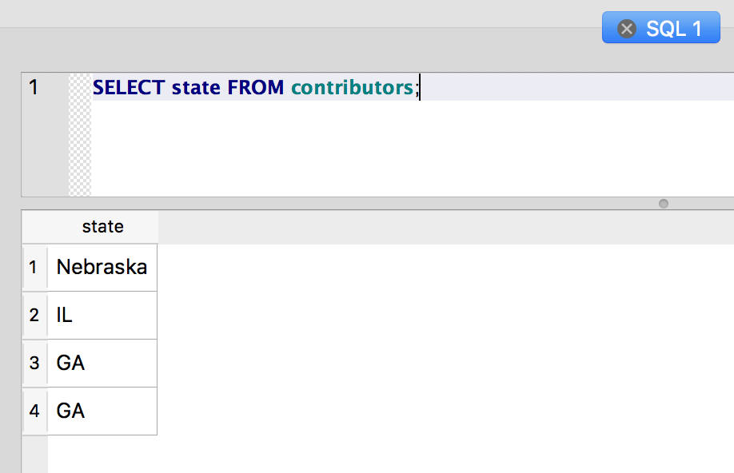
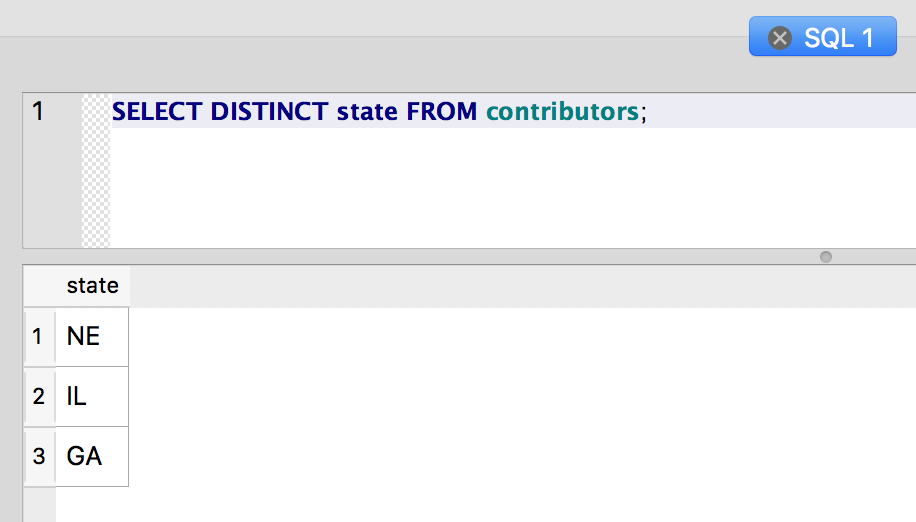

Changing values with UPDATE
~~~~~~~~~~~~~~~~~~~~~~~~~~~

Now we have some basic skills for creating tables, inserting data into
the table and querying the data we've inserted. But what about changing
the values in existing rows? To change the value of existing rows, we
use the ``UPDATE`` statement.

One thing that just looks wrong with our data set is that value
"Nebraska" in the state column:

::

   SELECT state FROM contributors;

|image1|

That should be the postal abbreviation, like the other rows. To change
that value, we need to use ``UPDATE`` to set a new value for the column.
**But we want to make sure we don't blow away the state values in our
other columns.**

If we just used ``UPDATE contributors SET state = 'NE';`` - **DON’T EXECUTE THIS!!** - we
would end up replacing the state value in every row with "NE". Not
exactly what we want.

So, we have to define a ``WHERE`` clause to determine which rows will be
changed by the ``UPDATE``:

::

   UPDATE contributors SET state = 'NE' WHERE state = 'Nebraska';

Ok, let's see how the state list looks:

::

   SELECT DISTINCT state FROM contributors;

|image2|

Now that's more like it.

