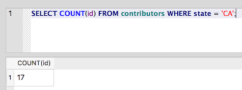
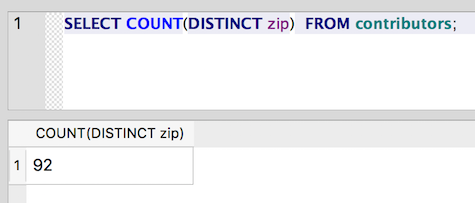
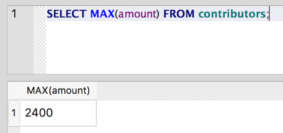
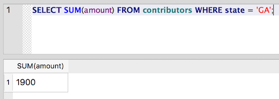
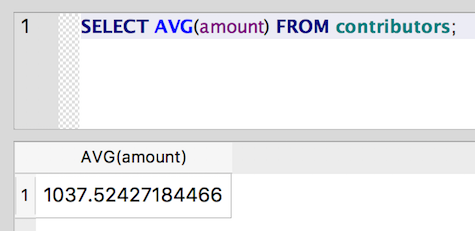

Aggregate Functions: COUNT, MAX, MIN, SUM, AVG
~~~~~~~~~~~~~~~~~~~~~~~~~~~~~~~~~~~~~~~~~~~~~~

Aggregate functions allow us to perform calculations on values across
rows. Using them, we can start to do some pretty interesting data
analysis. To specify a column to use for the aggregate, pass the column
name as the argument in parentheses: e.g. ``COUNT (counted_column)``. Here's
a quick run through some useful aggregate functions:

COUNT()
^^^^^^^

How many contributors do we have from California?

::

   SELECT COUNT(id) FROM contributors WHERE state = 'CA';

|count_ca|

The ``COUNT(id)`` function counts the number of unique ids. We could also
have used ``COUNT(*)``, which will count the number of rows. The result
will be the same.

``COUNT()`` can also be used with ``DISTINCT`` to return the number of distinct
instances. For example, how many distinct ZIP Codes are there in the
table?

::

   SELECT COUNT(DISTINCT zip)  FROM contributors;

Note that the the ``DISTINCT`` keyword comes inside the parentheses. It
is part of the argument passed to ``COUNT()``.

|distinct_zip|

.. _min-and-max:

MIN() and MAX()
^^^^^^^^^^^^^^^

What is the maximum amount that any of our contributors has given?

::

   SELECT MAX(amount) FROM contributors;

|max_amount|

SUM()
^^^^^

What is the total amount of contributions from Georgia?

::

   SELECT SUM(amount) FROM contributors WHERE state = 'GA';

|sum_ga|

AVG()
^^^^^

What is the average amount contributed?

::

   SELECT AVG(amount) FROM contributors;

|avg_amt|

Of course, the usual caveats about using averages apply. I heard a nice
example recently: "Which major at UNC produces graduates with the
highest average salary?" Apparently, it was Geography - Michael Jordan's
major. Even if it isn't true, it's a nice warning about the way outliers
can skew averages.

