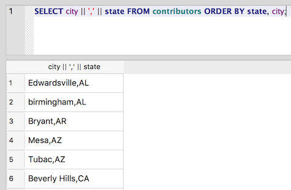

Pull yourself together: The concatenate operator (\|\|)
~~~~~~~~~~~~~~~~~~~~~~~~~~~~~~~~~~~~~~~~~~~~~~~~~~~~~~~

Sometimes we want to combine values from different columns, either in
the WHERE clause or for the results. SQLite uses double-pipes ( \|\| ) -
more formally known as the concatenation operator - to combine strings.
You can combine both literal strings (in quotation marks) and column values using
this operator.

Say, for instance, we want a nicely formatted list of cities and states
for contributors. To create a single result column that contains the
city and state separated by a comma, we can use this query:

::

   SELECT city || ',' || state FROM contributors ORDER BY state, city;

We insert the comma and space as a literal string concatenated with
the values from the city and state columns.

|image14|

   Note: Some other database management systems, such as MySQL use the
   ``CONCAT()`` function to perform concatenation. For example,
   ``SELECT CONCAT (city, ', ', state) FROM contributors;`` will *not* work in SQLite.

