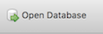

Getting started
----------------

For this section, we'll use a pre-packaged database containing 103 rows
of FEC data, with some light modifcations for the purposes of learning.

* Download :download:`contributors.db <../_data/contributors.db>`
* Fire up :doc:`DB Browser <../part1/install-db-browser>` if you don't already have it open
* Click "Open Database":
  |open_db|
*  Navigate to the "contributors.db" and open it

Now you're ready to dive deeper into SQL's features for querying 
and manipulating data, starting with how to 
handle :doc:`null values <../part2/is-null>`.

