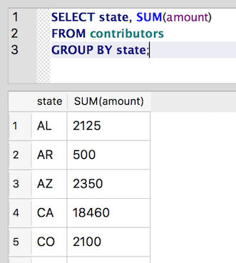
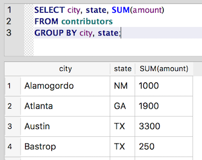
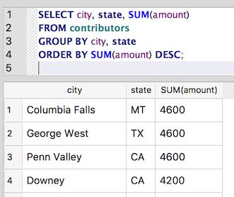

GROUP BY
~~~~~~~~

With some aggregate functions in our tool belt, we're ready to take
advantage of one of SQL's more powerful features: ``GROUP BY``. The ``GROUP BY``
statement is used in conjunction with aggregate functions to group the
results by a given column. Doing so allows us to write queries that
return :doc:`counts, sums, averages, minimums and maximums <aggregate-functions>`
per group.

    For Excel users, this feature mirrors the functionality of PivotTables.

So, what is the total amount of contributions per state?

::

   SELECT state, SUM(amount)
   FROM contributors
   GROUP BY state;

|amount_by_state|

It's also possible to group by a combination of columns. So, we can get
totals by city and state, as well:

::

   SELECT city, state, SUM(amount)
   FROM contributors
   GROUP BY city, state;

|amount_by_city_state|

And we can use the aggregate function in an :doc:`ORDER BY <../part1/sorting-results>`
statement to sort the results by total amount:

::

   SELECT city, state, SUM(amount)
   FROM contributors
   GROUP BY city, state
   ORDER BY SUM(amount) DESC;

|city_state_by_amount_desc|

   The syntax of this last statement is a little tricky. The columns to
   group by are separated by commas, but there is no comma before ``ORDER BY``
   or ``DESC``.

Most relational database management systems require that every
non-aggregate field in the ``SELECT`` statement also be included in the
``GROUP BY`` statement [#f1]_. Because ``SUM(amount)`` is an aggregate, we can include
it in the ``SELECT`` statement, even though it isn't included in the 
``GROUP BY`` list. But if we want to include city in the ``SELECT``,
we should also include it in the ``GROUP BY`` as well.

.. rubric:: Footnotes

.. [#f1] SQLite doesn't enforce this standard SQL restriction, which in some
   cases makes writing the query much simpler but in most cases can lead to
   unexpected results. But as a general practice and to make your queries portable to other
   systems, you should always include all columns for the ``SELECT`` in the
   ``GROUP BY`` list. If including that column in the ``GROUP BY`` isn’t possible,
   then you’ll probably need to use a :doc:`subquery <subqueries>` to create
   the desired result.
