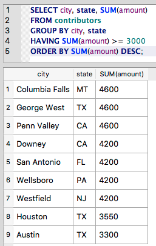
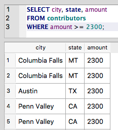
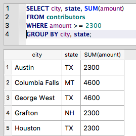
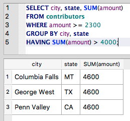

HAVING
~~~~~~

Now that we understand :doc:`grouping <group-by>` and :doc:`aggregates <aggregate-functions>`,
let's try filtering the results based on an aggregate. To start, let's find all
cities for which contributions total more than $3,000. Here's a first stab at
the query:

::

   SELECT city, state, SUM(amount)
   FROM contributors
   WHERE SUM(amount) >= 3000
   GROUP BY city, state
   ORDER BY SUM(amount) DESC;

And . . . no.

|warning_aggregate_where|

The error message isn't very helpful, but you can see "misuse of
aggregate: SUM()" is mentioned.

Turns out that aggregate functions can't be used in a ``WHERE`` clause. The
``WHERE`` clause acts as a filter on each row in turn, but here we want to
test an expression against an aggregate value for a group of rows (``SUM(amount)``).

The equivalent of a ``WHERE`` clause for aggregates is ``HAVING``.
It appears after the ``GROUP BY``:

::

   SELECT city, state, SUM(amount)
   FROM contributors
   GROUP BY city, state
   HAVING SUM(amount) >= 3000
   ORDER BY SUM(amount) DESC;

|having_amount_greater|

To get a better sense of the difference between ``WHERE`` and ``HAVING``, let’s
first look at a fairly simple query using ``WHERE``:

::

   SELECT city, state, amount
   FROM contributors
   WHERE amount >= 2300;

This query looks for individual contributors who have given at least
$2,300, and it returns their city, state and amount.

|where_gt_2300|

Now let's make this into an aggregate query by adding a ``GROUP BY`` and an
aggregate function:

::

   SELECT city, state, SUM(amount)
   FROM contributors
   WHERE amount >= 2300
   GROUP BY city, state;

|where_gt_2300_with_group|

We have the same nine cities that we had in the first query (those
cities in which someone donated at least $2,300). But now, rather than
having one row per contributor, we have one row per city. The ``GROUP BY``
eliminates the duplicate entries for cities in which more than one
person contributed at least $2,300. And by using the aggregate function
for ``SUM (amount)``, we're adding up all contributions of at least $2,300
for each city.

Now let's further filter this list of cities. We want to look only at
cities in which these large contributions ($2,300 or greater) made a big
difference. Let's call $4000 a big difference, for the sake of argument.
So, we want only those cities for which the total amount of
contributions at this size exceeds $4000.

   Looking at the results from the last query, we know to expect 3 rows,
   but it's not always so easy to see.

Here goes:

::

   SELECT city, state, SUM(amount)
   FROM contributors
   WHERE amount >= 2300
   GROUP BY city, state
   HAVING SUM(amount) > 4000;

And bam! We now have a list of cities where large contributions totaled more than $4000.

|where_plus_having|

.. |warning_aggregate_where| image:: ../_static/part2/warning_aggregate_where.png

