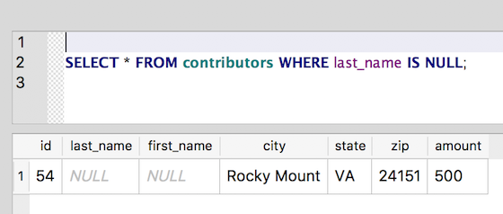
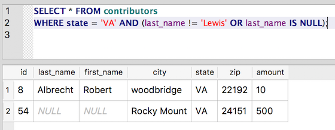

Nothing can come of nothing: Using IS NULL
~~~~~~~~~~~~~~~~~~~~~~~~~~~~~~~~~~~~~~~~~~

Let's take a look back at our original ``CREATE`` statement for the
contributors table:

::

   CREATE TABLE `contributors` (
       `id`    INTEGER NOT NULL PRIMARY KEY AUTOINCREMENT,
       `last_name` TEXT,
       `first_name`    TEXT,
       `city`  TEXT,
       `state` TEXT,
       `zip`   TEXT,
       `amount`    INTEGER
   );

Notice that we defined the ``id`` column as ``NOT NULL``, which meant that it
was a required field. Because that field is serving as our unique
identifier or PRIMARY KEY for the row, it can't be empty.

The keyword NULL is a special value in SQL. It's a placeholder for an
empty field. If a field is NULL, it's really empty. That means it's not
0. It's not an empty string (\"\"). If you're of a philosophical mind, you
might call NULL the “nothing that is”. If you're of a pragmatic mind,
you might just think of it as a placeholder where no value has been
entered.

But being nothing (or a placeholder for an empty value) comes with a
cost. NULL can't be compared with other data types such as strings. And
we can't use normal operators to match it, either. So ``=``, ``!=`` and friends
don't work with NULL. Don't believe me? Try it out:

::

   SELECT * FROM contributors WHERE last_name = NULL;

Instead, to query for null values, we use the keywords ``IS NULL``:

::

   SELECT * FROM contributors WHERE last_name IS NULL;

|last_name_null|

NULL’s refusal to respond to normal operators can lead to some
unforeseen effects. Take a look at this query, and guess what it should
return:

::

   SELECT * FROM contributors WHERE state = 'VA' AND last_name != 'Lewis';

|
   (Remember that ``!=`` means "is not equal.")

There are three contributors from VA in the table:

* Robert Albrecht,
* Donald S. Lewis
* and someone from Rocky Mount whose name fields are empty.
  (Yes, the data did come in like this from the FEC.)

You can see the list by using "Browse Data" and filtering the 
``state`` field for "VA", or by running this query:

::

   SELECT * FROM contributors WHERE state = 'VA';.

So, the clause ``WHERE state = 'VA' AND last_name != 'Lewis'`` looks like it's
asking for all contributors from Virginia whose last name is not Lewis.
And it looks like it should return both Albrecht and the Rocky Mount
contributor. But when we run it (cue "Price Is Right" sad horn sound),
we only get Albrecht:

|not_lewis|

"Curiouser and curiouser," you might say. This makes strict logical
sense when we consider that the NULL data type can't be compared with
any other data type, but really it does seem a bit of a pain (even to
some of the SQL gurus). The solution is to use ``IS NULL``. Here's one way
to write the query to get the results we intended:

::

   SELECT * FROM contributors WHERE state = 'VA' AND (last_name != 'Lewis' OR last_name IS NULL);

|
   (The parentheses are optional here, but they do help express our intentions.)

And now we get the two expected result rows:

|lewis_or_null|

IS NOT NULL
^^^^^^^^^^^

The opposite of ``IS NULL`` is (drumroll) . . . ``IS NOT NULL``. And it works
pretty much as we'd expect:

::

   SELECT * FROM contributors WHERE state = 'VA' AND last_name IS NOT NULL;

|is_not_null|

This negative form is pretty handy for filtering null values from the
results set.

.. |not_lewis| image:: ../_static/part2/not_lewis.png

.. |is_not_null| image:: ../_static/part2/is_not_null.png

