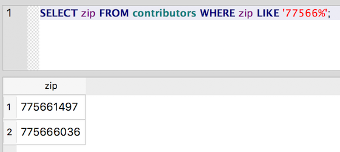
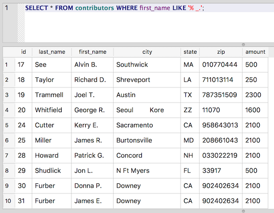

Casting a wider net with LIKE
~~~~~~~~~~~~~~~~~~~~~~~~~~~~~

While it's helpful to be able to write queries that look for equality
(last_name = 'Smith') or inequality (last_name != 'Smith'), sometimes
you want to do something a little messier, such as looking for everyone
whose last name starts with 'T'. Or maybe you want to look for matches
to a five-digit ZIP code, but some of your rows use ZIP+4. For these
kinds of expressions, you can use the ``LIKE`` operator, which will perform
a partial match.

   A brief aside worth mentioning: The ``LIKE`` operator is case-insensitive for
   English letters, so a query for "SMITH" or "smith" would both match the name "Smith."

To perform a partial match using ``LIKE``, you can combine normal characters
and special wildcard characters to construct a pattern. For example, the
percent sign (%) will match any sequence of zero or more characters. So
to match any zip that begins with 77566, we can use this statement:

::

   SELECT zip FROM contributors WHERE zip LIKE '77566%';

|zip_LIKE|

Notice that it matches both 775661497 and 77566036. It would also match
77566, because the % will match zero characters, too.

The % is probably the most common special character used in pattern
matching with ``LIKE``. Another less commonly used pattern matcher is the
underscore ("\_"), which matches any single character in the string.

Say, for example, we wanted to start cleaning our data, and we wanted to
remove the middle initials from the first_name field and put them into a
new middle_name column. (This sort of thing can get tricky very quickly,
but for now we'll trip along happily assuming everything goes smoothly.)

As a first step, we want simply to examine all of the rows that appear
to contain middle initials in first_name. Here's a query that will get
us at least part of the way there:

::

   SELECT * FROM contributors WHERE first_name LIKE '% _.';

Reading patterns like this one may prove a little tricky at first, but
in time . . . who am I kidding, it’s still pretty tricky, but you can
figure it out. Let’s break it down:

-  The pattern starts with %, which we know means "match any series of
   zero or more characters," which is pretty much anything.
-  Next we have a space. It's hard to see, but it's between the % and
   the underscore ( \_ ). So we're matching anything plus a space.
-  Then we have the magic underscore ( \_ ), meaning any single character.
-  And finally, we have a period (.), which is just a literal period
   here.

And here’s the result (you should get 60 rows, but we've truncated the results
here):

|like_initial|

So, in English, the pattern says to match "any series of characters
followed by a space, a single character, and a period."

This pattern will match things like:

* "John Q."
* "1234 5."
* "#$%^ !."
* " B."
* "J. B."

It won't, however, match the string "J. Quincy" because the period isn't the last
character in the field. Neither will it match "Alfred E. " because
we've left a space after the period.

To also match patterns that contain characters after the period, we
would need to add a final % to the pattern:

::

   SELECT * FROM contributors WHERE first_name LIKE '% _.%';

Now we're matching the pattern "any series of zero or more characters,
followed by a space, followed by a single character, followed by a
period, followed by any series of zero or more characters." (So, our
little pattern expresses a pretty complex thought.)

Of course, we could just match any first_name that contains a period,
like this:

::

   SELECT * FROM contributors WHERE first_name LIKE '%.%';

But then we also get names like "S. Truett," which may or may not be
what we intended.

   Note: Some database systems include other wildcard characters to be used
   in patterns. For example, in some systems the pattern ``[xyz]`` will match
   one of the characters "x," "y" or "z." And the pattern ``[^xyz]`` will match
   any character that is *not* an "x," "y" or "z. SQLite does not, by
   default, support this wildcard.

