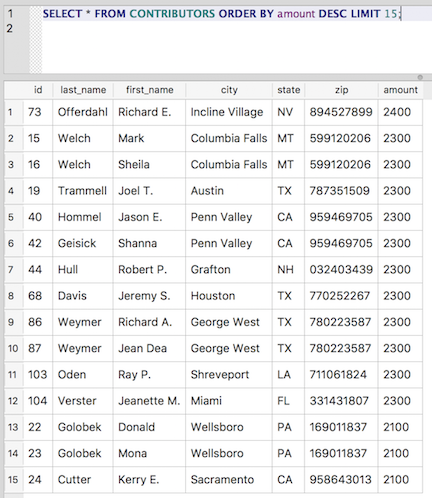

Knowing your limitations: Using LIMIT
~~~~~~~~~~~~~~~~~~~~~~~~~~~~~~~~~~~~~

So far, all of our queries have returned the full result set of rows
matching the WHERE clause. But sometimes you only want a subset of the
results. Let's use the ``LIMIT`` keyword to get the top 15 contributors by
contribution.

First we order the results by amount (in descending order), and then we
limit the results to only the first 15 rows:

::

   SELECT * FROM CONTRIBUTORS ORDER BY amount DESC LIMIT 15;

|top_15_contributors|

And if there aren't enough matching rows to reach the specified limit,
the limit is simply ignored:

::

   SELECT * FROM contributors WHERE amount > 2100 LIMIT 15;

