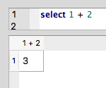
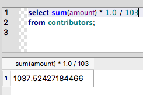
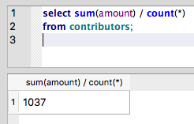
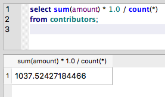

Beyond functions: Custom calculations
~~~~~~~~~~~~~~~~~~~~~~~~~~~~~~~~~~~~~

We've learned about many of the built-in functions that SQL provides for manipulating
:doc:`strings <string-functions>` and summarizing data
with :doc:`aggregates <aggregate-functions>`. But what if SQL doesn't provide 
a ready-made function for the task at hand?

Fortunately, SQL supports the ability to perform ad hoc calculations
in the ``SELECT`` clause [#f1]_.

Here's a really basic example:

::

   select 1 + 2

|one_plus_two|

Simple, though not very useful. Things get more interesting
when you start performing calculations on data.

Say that we wanted to know the average contribution amount for the entire data set.

   We'll pretend for now that we don't already know about the built-in
   :ref:`AVG <avg-amt>` function.

You can find that number by summing up all contributions and
dividing by the total number of contributions:

::

   SELECT sum(amount) * 1.0 / 103
   FROM contributors;

|avg_contrib_hardcoded_count|

Note that above, we've multiplied the sum of contributions ( ``sum(amount)`` )
by ``1.0``. This forces the amount -- which is an integer -- to be treated
as a decimal.

Failing to do so will result in SQLite dropping the numbers after the decimal,
causing you to lose precision that may be important in a given query:

|avg_non_decimal|

Also note that we can make this query more flexible by updating
the calculation to use the built-in :ref:`COUNT <count>` function,
instead of hard-coding the value.

::

   SELECT sum(amount) * 1.0 / count(*)
   FROM contributors;

|avg_contrib_dynamic_count|

These examples are fairly simple, but hopefully they demonstrate SQL's flexibility.
Built-in functions are quite handy, but there will likely come a time when
you need a custom calculation - perhaps in combination with a built-in function -
to get the job done.

.. rubric:: Footnotes

.. [#f1] Custom calculations work in other clauses as well, such
   as in ``WHERE`` clauses. We focus on ``SELECT`` here because it's
   one of the most common use cases for custom calculations.
