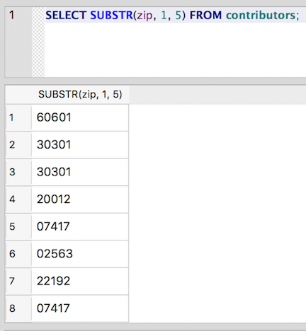
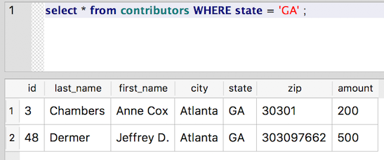
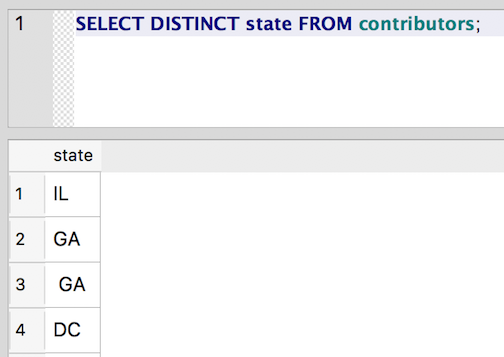
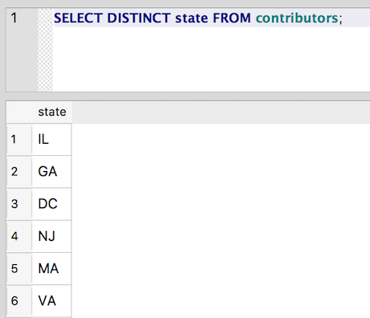
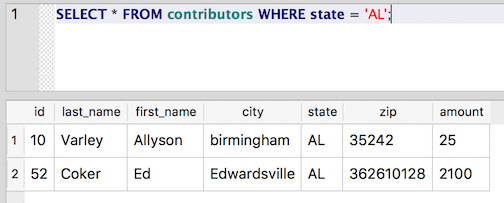

Using string functions: SUBSTR(), TRIM(), UPPER(), LOWER()
~~~~~~~~~~~~~~~~~~~~~~~~~~~~~~~~~~~~~~~~~~~~~~~~~~~~~~~~~~

Using ``LIKE`` for partial matches can be pretty powerful, but as we've
seen, patterns aren't exactly beach reading. Another way to do partial
matching is to use string functions to manipulate the values. String
functions usually take the form of a keyword followed by parentheses.
The parentheses contain any arguments we want to pass to the function.
The general format looks like this: ``KEYWORD (ARG1, ARG2, ARG3)``. Usually
the first argument is the string we want to manipulate. Here are some
commonly used string functions:

SUBSTR()
^^^^^^^^

The ``SUBSTR()`` function takes the string we hand it in the parentheses and
returns a part of the string that we define (ergo, substring).

*As we'll see with other string functions, this string argument can be - and 
typically is - the name of a column in a table. This gives us the power
to manipulate all the values for a given column (or perhaps a limited subset).*

To determine which part of the string to return, ``SUBSTR()`` accepts
a few additional arguments beyond the field that we're targeting:

* the starting point of the desired substring (counting characters from the left)
* the number of characters to grab from that starting point

The full function call takes this form: ``SUBSTR (STRING, START_POINT, LENGTH)``.
The third argument is optional. If we leave it off, ``SUBSTR()`` returns all
characters from the given starting point to the end of the string.

An example is probably more helpful. So, here is the ZIP query from
earlier, rewritten to use a substring match in the ``WHERE`` clause of the query:

::

   SELECT zip FROM contributors WHERE SUBSTR(zip, 1, 5) = '77566';

Above, we're asking for all ZIP codes in the table whose first five
characters match '77566'. This query will return the same result set
we saw earlier: 775661497 and 77566036.

Functions can also be used in the ``SELECT`` clause of the query, so we can
do something like this:

::

   SELECT SUBSTR(zip, 1, 5) FROM contributors;

Now we're getting the five-digit representation of all ZIPs in the
table (and dropping the extra four digits from the ZIP+4s):

|select_substr|

TRIM()
^^^^^^

The ``TRIM()`` function is most frequently used to trim white space from
either side of a string. During data entry, strings are often
accidentally inserted with leading or trailing whitespace. To simulate
this case, let's mess up the data even more:

::

   UPDATE contributors SET state = ' GA ' WHERE last_name = 'Cathy';

Now try selecting all rows where the state field is equal to 'GA' (with no extra surrounding
spaces around the state postal):

::

   select * from contributors WHERE state = 'GA';

|select_ga|

So, now Cathy isn't appearing in our list of Georgians. Even worse,
we've created a new state:

::

   SELECT DISTINCT state FROM contributors;

|distinct_state_space|

We can use ``TRIM()`` to clean things up:

::

   UPDATE contributors SET state = TRIM(state);

Notice here that we're not using a ``WHERE`` clause on the ``UPDATE`` statement.
This means that all rows will be updated, which is usually not what you
want at all. Consider if we had used ``SET state = 'GA'`` in the statement
above; we'd now have a table full of Georgians and a mess to clean up.
Because we're using a function, rather than a literal string here, we
can update everything at once, trimming the white space from the front
and end of every state value. The function operates on the value in the
state column for each row in turn.

And now we're back to normal:

::

   SELECT DISTINCT state FROM contributors;

|select_distinct_state_normal|

The ``TRIM()`` function can also be used to strip characters other than
spaces from the front and end of a string, although this usage is
probably less common. To tell ``TRIM()`` which characters to remove, pass a
second argument which contains any characters to be removed. For
example, ``TRIM (state, '.,')`` would remove any periods or commas appearing
at the beginning or end of the state name (i.e. "GA." would become
"GA").

UPPER() and LOWER()
^^^^^^^^^^^^^^^^^^^

Another common problem in dirty data is inconsistencies in
capitalization. For example, let's find all of the contributors from
Birmingham, Alabama:

::

   SELECT * FROM contributors WHERE state = 'AL' AND city = 'Birmingham';

Hmm . . . apparently there aren't any.

But when we check on all contributors from Alabama, we get a
different story:

::

   SELECT * FROM contributors WHERE state = 'AL';

|alabama|

So, the problem is that Birmingham isn't properly capitalized. Now, we
could do a SELECT using ``city = 'birmingham'``, but then we'd miss any rows
that properly capitalize the city name. And what about rows that use ALL
CAPS?

An easy way to get around these issues of case-sensitivity is to use the
``UPPER()`` or ``LOWER()`` string functions to standardize capitalization on the
values:

::

   SELECT * from contributors WHERE UPPER(city) = 'BIRMINGHAM';

The ``UPPER()`` function translates each letter in the city value to upper
case.

  Note that we are *not* changing the values in this column to upper-case. Instead,
  we're dynamically modifying the values in our ``WHERE`` clause purely for the
  purposes of matching records in a select query, leaving the original values unchanged.

As a result, this query will give us the lower-case version, but it will also match "Birmingham" and "BIRMINGHAM" (not to mention
"BIRMingham"), as they will all be rendered as "BIRMINGHAM" by ``UPPER()``.

   Note: By default :doc:`LIKE <../part2/like>` is *not* case-sensitive in SQLite,
   but that is not true of all database management systems. Also, in some other database
   systems, such as MySQL, the basic equality operator (=) is case
   insensitive, but that's not true in SQLite, and it isn't true in other
   systems. When in doubt, it's safer to use ``LOWER()`` or ``UPPER()`` to ensure
   case insensitivity. (Also, some databases use ``UCASE()`` and ``LCASE()`` rather
   than ``UPPER()`` and ``LOWER()``.)

