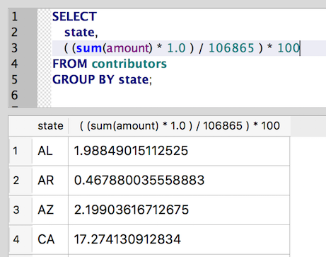
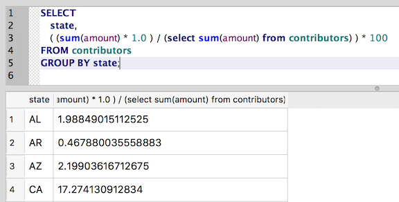

Revisiting subqueries
~~~~~~~~~~~~~~~~~~~~~

Before wrapping up Part II, let's revisit :doc:`subqueries <subqueries>`.

Recall that subqueries are SQL queries nested inside of a larger SQL statement.
They're especially useful for dynamically filtering results on the fly as part of
the ``WHERE`` clause. As we saw earlier, subqueries let us base the results of
one query on the results of another, without having to run the queries separately.

But subqueries aren't limited to use in the ``WHERE`` clause. Another
powerful -- and perhaps surprising -- use of subqueries is in ``SELECT``.

For example, say that you wanted to determine the percentage of all contributions
that came from each state.

You *could* perform this operation with two separate queries,
starting with a sum of all contributions:

::

   select sum(amount) from contributors;

The above query gives us a total of $106,865.

Next, we can use :doc:`GROUP BY <group-by>` to sum contributions by state, and
divide those totals by the sum of all contributions that we calculated above:

::

   SELECT
      state,
      ( (sum(amount) * 1.0 ) / 106865 ) * 100
   FROM contributors
   GROUP BY state;

|state_contrib_pct_hardcoded|

This works, but wouldn't it be nice if we could dynamically calculate the sum
of all contributions, rather than hard-code the total from the first query? That way, our
calculation should "just work" if we add more contributions to the database.

This is where the ``SELECT`` subquery can work its magic:

::

   SELECT
      state,
      ( (sum(amount) * 1.0 ) / (select sum(amount) from contributors) ) * 100
   FROM contributors
   GROUP BY state;

|state_contrib_pct_dynamic|

Above, we've simply replaced the hard-coded sum of all contributions
with the query that generated the value. SQLite will calculate this total once
and use it to determine each state's percentage of overall contributions.

Not too shabby. Subqueries in select statements can clearly be a powerful tool
in your SQL skill set, especially when combined with aggregates, ``GROUP BY`` and
other SQL features we've covered in Part II.

A word of caution
^^^^^^^^^^^^^^^^^

With this new power, of course, comes responsibility. As you begin writing
increasingly complex queries, they will become harder to read -- not to mention debug.

Be cautious as you craft such queries, making sure to format the SQL in a readable
way. Execute subsqueries independently before dropping them into a larger
SQL query, to ensure they're performing as expected. And for especially tricky syntax,
add `code comments <https://www.w3schools.com/sql/sql_comments.asp>`_ to explain the logic.

