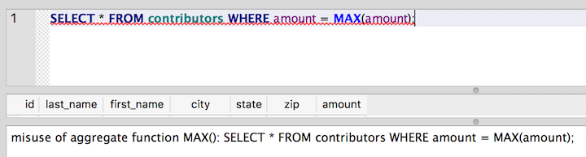
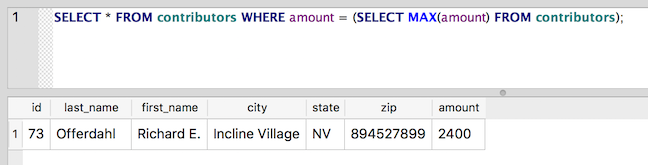
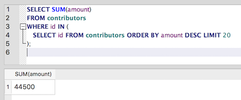

Subqueries, the Russian dolls of SQL
~~~~~~~~~~~~~~~~~~~~~~~~~~~~~~~~~~~~

When doing analysis, we often want to base one query on the results of
another query. For example, we used the :ref:`MAX() <min-and-max>`
function to determine the maximum amount contributed. But what if we 
want to know who actually gave that maximum amount? We could try something like this:

::

   SELECT * FROM contributors WHERE amount = MAX(amount);

But we won’t like the results:

|error_aggregate|

We could also simply run two different queries, one to get the maximum
amount, and another to find rows matching that amount:

::

   SELECT MAX(amount) FROM contributors;

..which returns 2400.

::

   SELECT * FROM contributors WHERE amount = 2400;

While that would work, it's a little clunky and brittle: If the
database is being updated often, we'd always have to run the lookup for
``MAX()`` first, in case the maximum amount changed between queries.

Wouldn't it be nice to be able to combine those two queries into one statement?
Well, we're in luck - a subquery is up to that task:

::

   SELECT * FROM contributors WHERE amount = (SELECT MAX(amount) FROM contributors);

|subquery_max|

The subquery appears in parentheses, and it stands in for the value we
want to test against amount. The subquery is executed first, and its
result is used in the outer query. Because the subquery returns 2400,
the query above gives the same result as a query for ``amount = 2400``.

This statement works because our subquery only returns a single value
(the value of ``MAX(amount)``). It's also possible to use a subquery that
returns multiple results, but in that case, we can’t use the ``=`` operator.

If we wanted, for example, to get the total contributions from the top
20 contributors, we would have a list of 20 rows we want to match
against. That's where our new friend ``IN`` comes to the rescue:

   Note that we're spreading the query across multiple lines
   since the query statement is starting to get long.
   Formatting SQL statements in this way helps with readability
   as you start writing increasingly complex queries.

::

   SELECT SUM(amount)
   FROM contributors
   WHERE id IN (
      SELECT id FROM contributors ORDER BY amount DESC LIMIT 20
   );

The subquery returns the ids of the first 20 rows ordered by amount. The
outer query asks for the sum of all amounts where the unique identifier
for our contributor is in the results of our subquery. When we put them
together, we get the sum of the amounts for the top 20 contributors:

|sum_top_20|

Note that there are other contributors in the list who have also donated
2100 (the smallest amount in the top 20), so the cut-off point is
arbitrary. Depending on the story, we might want to do something more
sophisticated with this query, such as looking for the sum of all
amounts less than 500, or something even more ambitious, such as looking
for the sum of all amounts within a certain percentile.

Subqueries can also be used with :doc:`DELETE <../part1/deleting-data>`,
:doc:`UPDATE <../part1/updating-data>` and :doc:`INSERT <../part1/inserting-data>`
statements.

