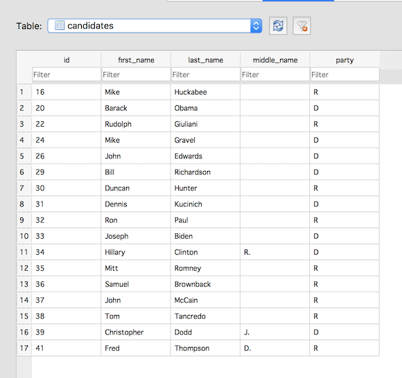

Spreading the data around: Data Normalization
~~~~~~~~~~~~~~~~~~~~~~~~~~~~~~~~~~~~~~~~~~~~~

All of the queries we've run so far are limited to a single table. If
all you ever do is import data from a spreadsheet, then you could always
limit your queries to a single table. But most data projects of any
depth soon involve multiple database tables.

Why would you want to separate the data into different tables? Well
let's think back for a moment to the description of relational databases
from Part I:

-  Data is organized into tables (relations) that represent a collection
   of similar objects (e.g. contributors).
-  The columns of the table represent the attributes that members of the
   collection share (last name, home address, amount of contribution).
-  Each row in the table represents an individual member of the
   collection (one contributor).
-  And the values in the row represent the attributes of that individual
   (Smith, 1228 Laurel St., $250).

So, a table represents a set of similar objects, and the objects all
share certain attributes. But we could stretch that definition quite a
bit: Contributors all have addresses, but they also have recipients (the
candidates who received the contributions). Should we include in our
**contributors** table the candidate name, the campaign address and
phone number, the office sought, the state in which the candidate is
running, etc? What about the campaign treasurer’s name? Committee
positions the candidate holds? Previous offices held?

Including all of this loosely related data in a single table takes us
pretty far afield of the original relation (Contributor). We would also
be storing a lot of redundant data (all of the candidate data would be
repeated for each contribution to a candidate). As a result, it could
become difficult to update the data. Changing a candidate's address, for
example, would require a change to each row containing a contributor to
that candidate. In addition, it would become increasingly difficult to
spot any data entry errors. Each misspelling of a candidate's name would
be like adding a new candidate, and it would be easier to overlook the
error amidst all the repeated data. Finally, all of this redundancy
means we're taking up more disk space than needed. (This last isn't as
big a concern as it once was when disk space was more expensive, but it
can present problems.)

So, in order to help ensure `data
integrity <http://en.wikipedia.org/wiki/Data_integrity>`__, to keep
tables logically coherent and to reduce disk usage, most database
designers implement some degree of data
`normalization <http://databases.about.com/od/specificproducts/a/normalization.htm>`__.
There are varying degrees of normalization, known as the "normal forms,"
but for practical purposes the goal is to remove repetition and to keep
only clearly related data in the same table.

So, let's go back to our hypothetically bulky **contributors** table
and do some minimal normalization. Let’s begin by imagining a table that looks
like this:

+---------+----------+----------------------+----------+-----+-----+------+----------+-------------------+--------------------+---------------+
|last name|first name|street                |city      |state|zip  |amount|date      |candidate last name|candidate first name|candidate party|
+=========+==========+======================+==========+=====+=====+======+==========+===================+====================+===============+
|Ahrens   |Don       |4034 Rennellwood Way  |Pleasanton|CA   |94566|250.00|2007-05-16|Huckabee           |Mike                |R              |
+---------+----------+----------------------+----------+-----+-----+------+----------+-------------------+--------------------+---------------+
|Agee     |Steven    |549 Laurel Branch Road|Floyd     |VA   |24091|500.00|2007-06-30|Huckabee           |Mike                |R              |
+---------+----------+----------------------+----------+-----+-----+------+----------+-------------------+--------------------+---------------+

Even with only two sample rows, it's easy to see the redundancy here.
Any place we see repetition has potential for some normalization.
Also, it's fairly clear that the table really represents two different relations
(contributors and candidates). So, one approach to restructuring this data is to create
**contributors** and **candidates** tables and separate the data accordingly.

To get started, let's create a fresh database. Start up *DB Browser for SQLite* and
perform the following steps:

- Click the *New Database* button and create a database called **contributors_candidates**.
- Save it somewhere you can find it, such as the Desktop.

Next, we'll create the **candidates** table. Here's the SQL CREATE
TABLE statement to execute:

::

   CREATE TABLE "candidates" (
      "id" INTEGER PRIMARY KEY NOT NULL,
      "first_name" TEXT NOT NULL,
      "last_name" TEXT NOT NULL,
      "middle_name" TEXT,
      "party" TEXT NOT NULL
   );

This should all be old hat by now. We're just creating a table for the
candidates, including some basic information (name and party), and
adding a **PRIMARY KEY**, a unique identifier for each candidate.

Now, let's add some data to that table. Download :download:`candidates.txt <../_data/candidates.txt>`
and import it using the `File -> Import -> Table from CSV file...` menu (see
:doc:`Importing Data <../appendix/importing-data>` for more details).

- For the "Table name" field, the value should say *candidates*
- Make sure there's a check mark in the "Column names in first line" box
- And set the "Field separator" value to Pipe (|).
- Click OK and when prompted, confirm that you want to
  import the data into the existing **candidates** table.

You should now have 17 rows in the **candidates** table:

|browse_candidates|

So now, rather than having candidate data included with each row of the
contributor data, we have one row for each candidate. It’s a much
cleaner data structure.

.. include:: license_snippet.rst.inc

