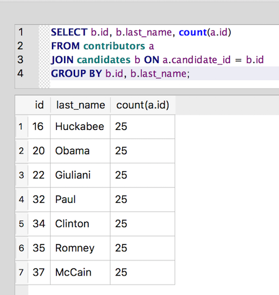

Explicit JOIN syntax
~~~~~~~~~~~~~~~~~~~~

In addition to the :ref:`implicit join <implicit-joins>` syntax, SQL includes an explicit
``JOIN`` keyword. So, we could write the :ref:`earlier query <implicit-join-query>` using this syntax instead:

::

   SELECT contributors.last_name,
          contributors.first_name,
          candidates.last_name
   FROM contributors
   JOIN candidates ON contributors.candidate_id = candidates.id;

The query results should be the same as earlier, but using the ``JOIN``
keyword makes the intent of the query more explicit.

Aliases work with ``JOIN`` as well:

::

   SELECT a.last_name,
          a.first_name,
          b.last_name
   FROM contributors a
   JOIN candidates b ON a.candidate_id = b.id;

Now let's try something a bit more interesting:

.. _explicit-join-group-by-query:

::

   SELECT b.id, b.last_name, count(a.id)
   FROM contributors a
   JOIN candidates b ON a.candidate_id = b.id
   GROUP BY b.id, b.last_name;

|image8|

Excellent! We now know that we have 25 contributors for each candidate.
Very cool. But, hey, wait. Our list of candidates seems to be coming up
short. Let's check it:

::

   SELECT DISTINCT id, last_name FROM candidates;

The above query shows that we have 17 candidates total -- in other words,
the ``JOIN`` query is missing 10 candidates. What going on here? SQLite has gone mad!

Actually, there's a pretty sensible explanation for this result. We said
earlier that performing the ``JOIN`` would return the same results as the
query with this clause: ``WHERE contributors.candidate_id = candidates.id``.

What if a candidate has no contributors? Then that candidate is not
returned by the query.

The ``JOIN`` acts just like the ``WHERE`` clause and filters out any rows that
don’t match the condition defined. Joins that return only rows in which
there is a match in both tables are known as `INNER JOINs <https://www.w3schools.com/sql/sql_join_inner.asp>`_.
This is often exactly the behavior you want from the join (ignore any rows from
either table that don't relate to a row in the other table). So by
default, the ``JOIN`` keyword executes an ``INNER JOIN``. You can also
explicitly request an ``INNER JOIN``, just to make things clearer:

::

   SELECT b.id, b.last_name, count(a.id)
   FROM contributors a
   INNER JOIN candidates b ON a.candidate_id = b.id
   GROUP BY b.id, b.last_name;

The results will be the same.

.. include:: ../license_snippet.rst.inc

