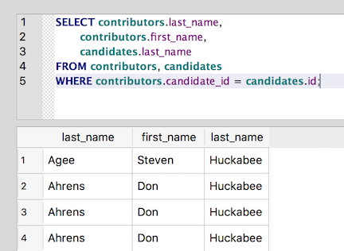

Reaching across the aisle using JOIN
~~~~~~~~~~~~~~~~~~~~~~~~~~~~~~~~~~~~

One way to run a query that uses data from two different tables is to
use a :doc:`subquery <../part2/subqueries>`.

For example, to find all of the contributors to Barack Obama, you can
do something like this:

::

   SELECT *
   FROM contributors
   WHERE candidate_id = (
      SELECT id
      FROM candidates
      WHERE last_name = 'Obama' AND first_name = 'Barack'
   );

.. _implicit-joins:

This approach works fine as long as you're simply looking up values in
one table and using them in the conditions for the ``WHERE`` clause. But
often the queries you'll want to run will need to treat the two tables
as a combined data set. A query that combines the data from two tables
is known as a **join** on the tables. It is possible to do an **implicit**
join simply by defining the relationship between the two tables in the ``WHERE`` clause:

.. _implicit-join-query:

::

   SELECT contributors.last_name,
          contributors.first_name,
          candidates.last_name
   FROM contributors, candidates
   WHERE contributors.candidate_id = candidates.id;

|image7|

Notice that we're including both of the tables in the ``FROM`` clause.
Also notice that we're using a fully-qualified version of the column
names: *contributors.last_name*, *candidates.last_name*.
We're including the table name here because *last_name* appears in both tables. So,
just using *last_name*, as we usually would, would be ambiguous (the
last name of the contributor or the last name of the candidate?).
Adding the table name and a dot (.) before the column name disambiguates the column.

Using Aliases
^^^^^^^^^^^^^

Including the full table name with each column name can become a bit
tedious. So, SQL allows you to define an `alias <https://www.w3schools.com/sql/sql_alias.asp>`_
for the table. To do so, simply include the alias after the table name in the ``FROM`` clause. Then
you can use that alias, rather than the full table name, elsewhere in
the query:

::

   SELECT a.last_name, a.first_name, b.last_name
   FROM contributors a, candidates b
   WHERE a.candidate_id = b.id;

This query returns the same results as the one above, but it saves
some typing by making "a" an alias for *contributors* and "b" an alias
for *candidates*. The alias can use any valid table name you
like, but obviously shorter aliases will save more typing, while
longer ones may make the intention of the query easier to understand.

.. include:: ../license_snippet.rst.inc

