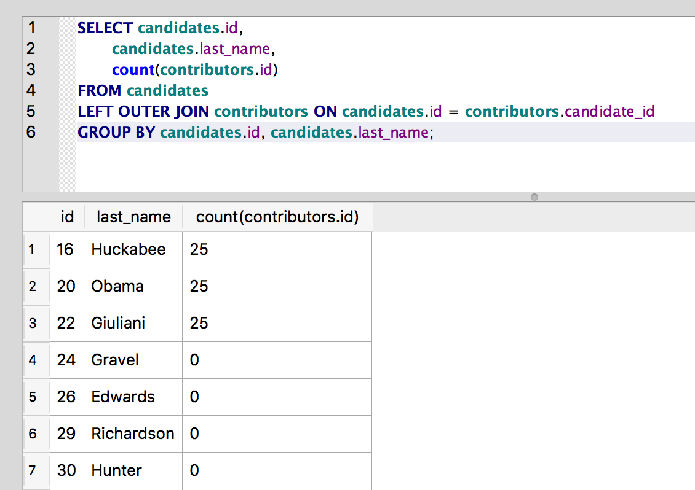

OUTER JOIN
~~~~~~~~~~

But how do we get the full list of candidates along with the number of
contributors for each, including those candidates who have no
contributors in our data set? SQL provides the "OUTER JOIN" syntax for
doing just that. Outer joins are typically defined by the table from
which we want to include non-matching rows, and we do so by referring to
where that table appears in the JOIN statement.

-  A ``LEFT OUTER JOIN`` includes all rows from the table on the left side
   of the statement and only matching rows from the table on the right
   side of the statement.
-  A ``RIGHT OUTER JOIN`` includes all rows from the table on the right side
   of the statement and only matching rows from the left side of the
   statement.
-  A ``FULL OUTER JOIN`` includes all rows from both tables.

Currently, SQLite only supports ``LEFT OUTER JOIN`` from the list above, but
some other database management systems support the other two types as
well.

.. note:: It's easy to perform a ``RIGHT OUTER JOIN`` in SQLite by
   simply reversing the order of tables and using a ``LEFT OUTER JOIN``. It's
   also possible to do a ``FULL OUTER JOIN`` by combining LEFT OUTER JOINs
   using the `UNION <https://www.w3schools.com/sql/sql_union.asp>`_ keyword.

This all probably makes more sense in an example. Let's rewrite the
:ref:`grouping query <explicit-join-group-by-query>` from earlier to include all candidates:

::

   SELECT candidates.id,
          candidates.last_name,
          count(contributors.id)
   FROM candidates
   LEFT OUTER JOIN contributors ON candidates.id = contributors.candidate_id
   GROUP BY candidates.id, candidates.last_name;

*(Aliases would work here as well, but I've used the full table names to
make the relationships clearer.)*

Notice the JOIN statement: candidates ``LEFT OUTER JOIN`` contributors.
Because **candidates** is on the left side of that statement, the result
set will include all of the candidate rows, even those for which there
are no matching **contributors**:

|image10|

Much better.

.. include:: ../license_snippet.rst.inc

