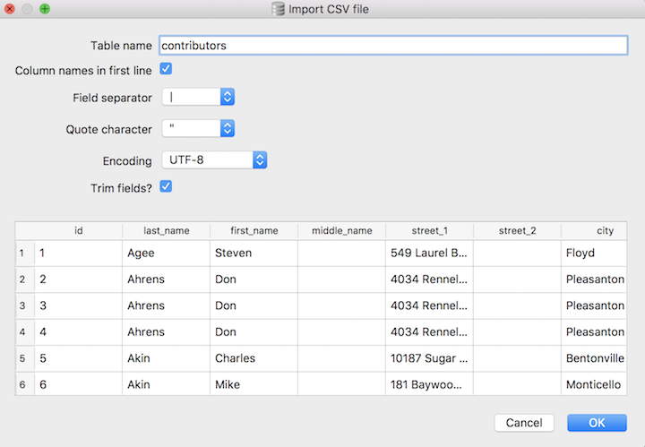
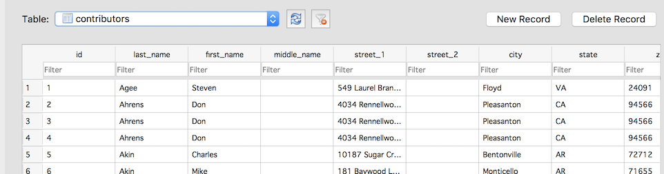

Referentially speaking: Associating tables using foreign keys
~~~~~~~~~~~~~~~~~~~~~~~~~~~~~~~~~~~~~~~~~~~~~~~~~~~~~~~~~~~~~

So, now we have the candidates table, but we also have a problem. Now
that we've moved the candidate data out of the **contributors** table,
how do we link contributors to their candidates? Without this link, we
have no way of running queries that give, for example, total
contributions per candidate. To create this reference between the two
tables, we'll need a common field that the two tables share. The
standard way of setting up this relationship is to include the **Primary
Key** from the **referenced** table as a field in the **referencing**
table. The new column in the referencing table is known as a `Foreign
Key <http://en.wikipedia.org/wiki/Foreign_key>`__.

Simply creating this foreign key column in the referencing table would
be enough to let us run queries across both tables, but SQL also allows
us to explicitly declare the foreign key and thus enforce this reference
at the database level.

So, let's create a new **contributors** table, but in addition to the
data about the contributor, let's add a **candidate_id** field and let
SQLite know that it is a foreign key referencing the **id** column in
the **candidates** table:

::

    CREATE TABLE "contributors" (
    "id" INTEGER PRIMARY KEY NOT NULL,
    "last_name" TEXT,
    "first_name" TEXT,
    "middle_name" TEXT,
    "street_1" TEXT,
    "street_2" TEXT,
    "city" TEXT,
    "state" TEXT,
    "zip" TEXT,
    "amount" INTEGER,
    "date" TEXT,
    "candidate_id" INTEGER NOT NULL,
    FOREIGN KEY(candidate_id) REFERENCES candidates(id)
    );

Notice the last two lines of that CREATE statement. The penultimate line
adds the **candidate_id** column, defines it as an integer, and makes it
a required field (it cannot be null). The final line defines
**candidate_id** as a foreign key referencing the **id** column in the
**candidates** table.

Now SQLite will enforce this reference, and if we try to enter a row in
the **contributors** table without a **candidate_id** or using a
**candidate_id** that doesn’t actually appear in the **candidates**
table, we’ll get an error. In other words, every contributor must now
have a candidate, and that candidate must already exist in the
**candidates** table.

Now let's add some contributor data to the table. Download the text file at
:download:`contributors_with_candidate_id.txt <../_data/contributors_with_candidate_id.txt>` 
and import it into the **contributors** table using the 
`File -> Import -> Table from CSV file...` wizard:

|image5|

- **NOTE:** You'll have to set the table name to **contributors**.
  Otherwise, SQLite will create a new table called
  **contributors_with_candidate_id**, based on the name of the text
  file.
- Make sure there's a check mark in the "Column names in first line" box
- And set the "Field separator" value to Pipe (|).
- Click OK and when prompted, confirm that you want to
  import the data into the existing **contributors** table.

You should now have 175 rows in the **contributors** table [#f1]_:

|image6|

.. rubric:: Footnotes

.. [#f1] A quick aside about the text file: It contains a pre-populated `id` column,
   so we’ll have unique **Primary Key** values. For the
   **candidates** table, we specified the `id` field in each row so that
   they would match the **candidate_id** values in this data. In a real
   project, we would probably use autoincrementing values for the ids in
   the **candidates** table, and populating the **candidate_id** field in
   the **contributors** table with the appropriate value would be a
   separate task.

.. include:: ../license_snippet.rst.inc

